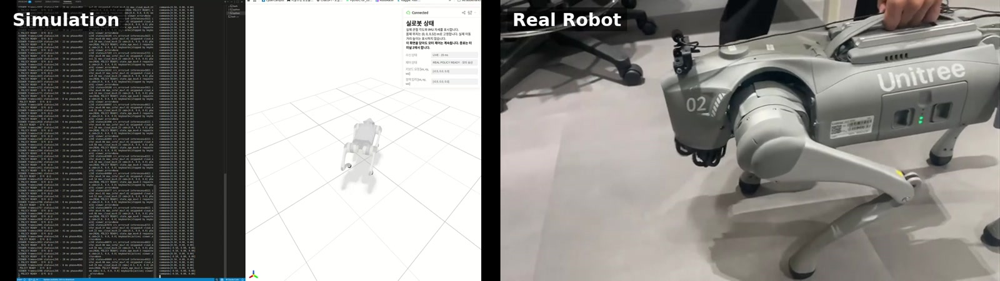

# Go2 RL 작업 기록

`~/go2_rl`에서 진행하는 Unitree Go2 강화학습, 시뮬레이션, 실제 로봇 제어와 sim2real 연결을 정리하는 문서 저장소다. 코드·체크포인트·모델·실행 로그는 `~/go2_rl`에서 관리하며, 여기에는 현재 구현과 확인 결과를 한국어로 기록한다.

## Progress Videos

Videos documenting policy deployment and robot experiments. Latest updates appear first.

### 2026-10-07 — Learned Locomotion Policy Deployed on the Real Robot

Synchronized side-by-side footage of the MuJoCo visualization and the real Go2 robot.

[▶ Watch on YouTube](https://youtu.be/tbz4j0fWV4E?si=EWEwPF1a_iUDlggj)

## 문서 구성

| 폴더 | 기록하는 내용 |
|---|---|
| [rl](rl/README.md) | mjlab 환경, Actor/Critic 관측, 행동과 보상, PPO 학습, 체크포인트와 현재 학습 확인 상태 |
| [real](real/README.md) | 실제 Go2 센서 피드백, 호스트 ONNX 제어, 키보드·DDS·상태 전환·복귀 절차 |
| [simulator](simulator/README.md) | 학습·재생, ROS 2 내비게이션 시뮬레이션, C++ MuJoCo DDS 브리지의 역할과 실행 방법 |
| [sim2real](sim2real/README.md) | 정책 관절 ↔ SDK 모터 매핑, 47차원 관측, 행동·PD·시간 간격, 정책 내보내기와 대응 검증 |

각 문서에 나오는 `scripts/...`, `src/...`, `deploy/...` 등의 경로와 실행 명령은 **원본 작업 폴더 `~/go2_rl` 기준**이다. 이 문서 저장소를 복제한 위치에서 제어·학습 명령을 실행하려면 원본 코드와 해당 실행 환경을 별도로 준비해야 한다.

## 기록 기준

- 확인일: **2026-10-07, Asia/Seoul**.
- 원본 작업 경로: `~/go2_rl`.
- 원본 Git 기준 커밋: `35605c5c01887d7ab099736c357536e5006d64e6` (`feat: add Go2 simulation navigation and real closed-loop control`).
- 기준은 해당 커밋에 **현재 로컬 수정과 미추적 파일을 포함한 작업 트리**다. 커밋만 체크아웃하면 이 문서의 환경이 모두 재현되지는 않는다.
- 문서 작성 시 원본의 변경 추적 파일: `deploy/include/unitree_articulation.h`, `doc/setup_en.md`, `doc/setup_zh.md`, `kante_.md`, `src/go2_autonomous_driving/README.md`, `src/tasks/go2/registry.py`, `src/tasks/go2/step_02_learning/rewards.py`.
- 로컬에 추가된 주요 항목: `model_10000.pt`, `1.2_3.npz`, `Navigation-Physical-Experiment/`, `docker/`, `doc/go2_autonomous_driving/`. `.gitignore`로 제외된 `artifacts/go2_real/`, `logs/`, `log/`의 현재 산출물도 조사했다.

기존 `kante_.md`, `sim2real_mapping.md`의 과거 설명은 현재 소스·설정·산출물과 대조했다. 설정값, 저장된 로그 결과, 이번에 직접 실행한 검증 결과를 구분해 적었다.

## 현재 상태

현재 실기용 정책은 Flat의 **Actor 47차원 → 행동 12차원**이며, 정책 주기는 **50 Hz**다. Python 실기 폐루프는 실제 IMU·관절 상태를 받아 호스트에서 ONNX를 추론하고 **500 Hz 설정의 LowCmd 루프**로 목표 관절각을 전달한다. 시뮬레이션 내비게이션과 실제 로봇 제어, 실측 상태 뷰어는 각각 독립된 경로다.

이번 문서 작성 중 로봇 통신이나 제어를 시작하지 않고 `scripts/check_go2_real_policy.py`의 저장 데이터 검증을 실행했다. 100프레임에서 ONNX/Torch 출력 최대 오차는 `8.344650268554688e-07`, 관측 매핑 최대 오차는 `1.6689300537109375e-06`으로 기존 `1e-4` 기준을 통과했다. 이는 정책 파일과 관측 변환의 일치성을 확인한 결과다. 실기 보행 안정성과 고속 동작은 각 문서에 기록한 별도 검증 대상이다.

현재 C++ 배포 소스에는 헤더 끝에 명령문이 붙은 로컬 변경이 있으며, C++의 기울기 종료 검사도 항상 `false`를 반환한다. Python 제어 경로의 검사와 구분해 [실기 문서](real/README.md)와 [매핑 문서](sim2real/README.md)에 설명했다.

## 기록 갱신 방법

원본의 환경·관측·행동·학습 설정이 바뀌면 `rl/`을, 실제 실행·네트워크·제어 전환이 바뀌면 `real/`을, 시뮬레이터·센서·내비게이션 구성이 바뀌면 `simulator/`를 갱신한다. 정책이나 로봇 모델을 교체할 때는 `sim2real/`의 관절 순서·기본 자세·관측 순서·배율·PD·주기를 함께 확인한다. 확인일과 검증에 사용한 모델·설정·로그 출처도 남긴다.
