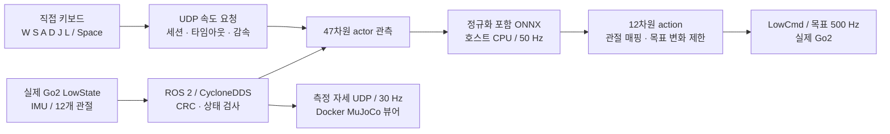

# 실제 Go2 제어 현황

이 문서는 **2026-10-08의 `~/go2_rl` 작업 트리**를 기준으로 실제 로봇 제어 구성을 기록한다. 기준 커밋은 `472850eebd2194eb71141b1349087145e4974f30` (`1008_refactor_2`)다. 아래 소스 경로와 실행 명령은 공개 문서 저장소가 아닌 **원본 `~/go2_rl`**을 기준으로 한다.

현재 중심 경로는 **실제 Go2의 IMU·관절 피드백으로 호스트에서 학습 정책을 실행하고, 키보드 속도 명령을 받아 관절 목표를 보내는 Python 폐루프 제어**다. 기존 Unitree SDK2 기반 C++ 배포 경로도 소스에 남아 있다. 두 경로는 실행 파일, 정책 위치, 입력 장치, 제어 주기가 다르므로 구분해서 사용한다.

오늘 리팩터링에서는 기존 패키지의 Python 코드를 `sim/`과 `real/`로 나눴다. 실기 제어는 `src/go2_autonomous_driving/go2_autonomous_driving/real/`에 있으며, 새 `src/go2_autodrive/`는 시뮬레이션 내비게이션용 패키지다. 실기 실행 스크립트 이름은 유지되고 `python -m` 진입점이 `go2_autonomous_driving.real.real_closed_loop`로 바뀌었다. 제어·매핑·정지 전환 로직과 `real_closed_loop.json`의 수치는 이전 기록과 같다.

## 1. 두 제어 경로의 상태

| 항목 | 현재 Python 폐루프 | 기존 C++ 배포 경로 |
| --- | --- | --- |
| 진입점 | `scripts/run_go2_real_closed_loop.sh` | `deploy/robots/go2/main.cpp` → `go2_ctrl` |
| 통신 | ROS 2 `rclpy` + CycloneDDS + 공식 `unitree_go`/`unitree_api` 메시지 | Unitree SDK2 DDS |
| 정책 | `src/go2_autonomous_driving/model_pt/model_10000.pt`에 대응하는 `artifacts/go2_real/policy.onnx` | 선택한 정책 디렉터리의 `exported/policy.onnx` |
| 속도 명령 | 직접 키보드의 몸체 기준 `[vx, vy, wz]` | Unitree 무선 리모컨 조이스틱 |
| 정책 주기 | `step_dt=0.02 s`, 목표 50 Hz | `step_dt=0.02 s`, 목표 50 Hz |
| 관절 송신/FSM 주기 | 활성 제어 루프 `0.002 s`, 목표 500 Hz | FSM `0.001 s`, 목표 1,000 Hz |
| 최초 실행 | 모터 송신 없는 dry-run이 기본 | Passive 상태에서 시작하는 FSM |
| 현재 확인 범위 | 정책 일치, 실제 센서 dry-run 기록, 가상 DDS 전환·종료 검증 | 소스 구조만 조사; 현재 빌드·정책 배치 미완료 |

주기는 코드의 목표값이다. 호스트 Python·ROS 실행으로 모든 상황의 실시간 주기가 보장되는 것은 아니다. Python 경로는 정책 지연과 모터 루프 지연을 감시한다.

## 2. 현재 Python 폐루프 구성



`real_closed_loop.py`는 `real_robot.py`의 공통 DDS·모터·정책 스레드 위에 직접 키보드 입력을 연결한다. 실제 `/lowstate`를 읽으며 위치추정·점군·플래너를 요구하지 않는다. `/lowcmd` 송신자는 `--execute`와 대화형 `ARM` 절차가 통과한 뒤 생성한다. 기본 실행은 모드를 읽고 추론·상태 표시를 수행하지만 LowCmd를 발행하지 않는다.

### 정책과 실제 센서

현재 실기 기본 체크포인트는 `src/go2_autonomous_driving/model_pt/model_10000.pt`이며, 루트의 `model_10000.pt`는 없다. `artifacts/go2_real/`에 다음 파일이 실제로 존재한다.

| 파일 | 역할 |
| --- | --- |
| `policy.onnx` | 관측 정규화를 포함해 내보낸 actor |
| `policy.json` | 체크포인트/ONNX SHA-256, 관절 이름·순서·범위, 기본 자세, 게인, 주기 |
| `parity.npz`, `samples.json` | 원본 정책과 호스트 ONNX·관측 매핑을 비교하는 100개 프레임 |

정책 입력은 47개다: 몸체 각속도 3, 몸체 좌표계 중력 방향 3, 속도 명령 3, 보행 위상 2, 기본 자세 대비 관절 위치 12, 관절 속도 12, 이전 적용 action 12. IMU quaternion은 `wxyz` 순서로 사용하며 보행 위상 주기는 `0.6 s`다. 속도 명령 크기가 `0.1` 미만이면 위상 관측을 `[0, 0]`으로 만든다.

출력 action 12개는 `기본 관절각 + 0.25 × action`으로 목표 위치가 된다. 정책 관절 순서는 `FL → FR → RL → RR`, SDK 순서는 `FR → FL → RR → RL`이다. 각 다리 안에서는 `hip → thigh → calf`이며, 정책→SDK 인덱스는 `[3,4,5,0,1,2,9,10,11,6,7,8]`이다. 기본 자세·관절별 게인·한계는 `policy.json`에서 읽는다. 한 다리의 hip/thigh/calf 기준 `kp=[20,20,40]`, `kd=[1,1,2]`이다. 자세와 매핑의 상세 표는 [sim2real 문서](../sim2real/README.md)에 정리한다.

실행 시 PT와 ONNX의 해시가 메타데이터와 다르면 중단한다. 체크포인트를 교체했다면 변환과 관측 검증을 다시 해야 한다. MuJoCo의 가상 상태·접촉 정보는 이 실제 제어 정책의 입력으로 사용하지 않는다.

이번 파일 이동 후에도 PT와 ONNX의 SHA-256은 기존 산출물·메타데이터와 일치한다. 새 시뮬레이션 패키지의 `src/go2_autodrive/config/model_pt/model_10000.pt`도 같은 내용이다. 경로만 옮긴 것은 새 정책 학습이나 ONNX 재변환을 의미하지 않는다.

### 네트워크와 프로세스

현재 로컬 구성은 다음과 같다.

| 연결 | 설정 |
| --- | --- |
| 로봇 LAN | 호스트 `enp3s0`, `192.168.123.99/24`; Go2 `192.168.123.161` |
| 로봇 DDS | domain `0`, `RMW_IMPLEMENTATION=rmw_cyclonedds_cpp` |
| 키보드 → 제어기 | 로컬 UDP `127.0.0.1:9901` |
| 제어기 → 실제 자세 뷰어 | 로컬 UDP `127.0.0.1:9902` |
| 제어기 → 키보드 상태 | 로컬 UDP `127.0.0.1:9903` |
| 웹 뷰어 | `http://localhost:8080` |

인터페이스 변경은 제어/복구 스크립트에 `GO2_NETWORK_INTERFACE=인터페이스명`을 지정한다. 키보드와 뷰어는 로봇 DDS로 직접 명령을 보내지 않는다. 실제 제어 UDP는 시뮬레이션 전용 `9871/9872`와 분리되어 있다. 웹 뷰어 기본 포트 8080은 시뮬레이션 뷰어와 겹치므로 함께 쓸 때는 실제 뷰어의 `--port`를 바꾼다.

실기 제어·키보드는 기존 호스트 환경을 사용한다. 제어 스크립트는 `/opt/ros/jazzy/setup.bash`와 프로젝트의 `install/setup.bash`를 불러오며, 정책은 호스트 `.venv_go2_real`의 ONNX Runtime CPU 실행이다. 실기 뷰어는 Docker `unitree-rl-mjlab`에서 실행한다. 오늘부터 `run_go2_real_viewer.sh`가 공통 `scripts/run_go2_docker.sh`를 통해 `go2_autonomous_driving.real.real_state_viewer`를 실행한다. 컨테이너 내부 프로젝트 경로는 `/workspace/unitree_rl_mjlab`이다.

## 3. 준비와 실행

다음은 원본 작업 공간에서 사용하는 절차를 기록한 것이다. 이 문서를 작성하면서 로봇 제어나 ROS 노드를 실행하지 않았다.

### 환경 준비

처음 설치할 때 [시뮬레이터 문서](../simulator/README.md)의 Docker 환경과 호스트 ROS 환경을 먼저 준비한다. 체크포인트를 `src/go2_autonomous_driving/model_pt/`에 둔 뒤 다음 스크립트를 사용한다.

```bash
cd ~/go2_rl
bash scripts/prepare_go2_real_robot.sh
```

스크립트는 공식 `unitree_ros2`를 `third_party/go2_navigation/unitree_ros2`에 준비하며, 새 clone의 기준 버전은 `668d1ec5a05d1c38d3306bdca7d59f2ba3581a88`이다. 이어 `unitree_go`, `unitree_api`, `go2_autonomous_driving`을 colcon으로 빌드하고, 호스트 `.venv_go2_real`과 `onnxruntime==1.23.2`를 준비한다. 모델 변환은 공통 `run_go2_docker.sh`를 통해 Docker에서 `scripts/export_go2_real_policy.py`를 실행하며, 마지막 정책 일치 검사는 호스트 가상환경에서 수행한다. export의 학습 registry import도 `src.locomotion_rl`로 갱신됐다. 이미 존재하는 외부 checkout을 스크립트가 매번 기준 커밋으로 되돌리지는 않는다.

기존 설치 환경을 갱신할 때는 이동된 모듈과 변경된 ROS 진입점을 반영하도록 `go2_autonomous_driving` 패키지를 다시 빌드한다. 같은 체크포인트의 위치만 바뀌었다면 ONNX를 재변환할 필요는 없다.

### 모터 송신 없는 확인

각 명령은 별도 터미널에서 실행한다.

```bash
# 터미널 1: 측정 자세 뷰어
cd ~/go2_rl
bash scripts/run_go2_real_viewer.sh
```

브라우저에서 `http://localhost:8080`을 연다.

```bash
# 터미널 2: 실제 센서 수신·정책 추론, 기본은 모터 송신 없음
cd ~/go2_rl
bash scripts/run_go2_real_closed_loop.sh
```

`phase=[DRY READY]`를 기다린다. 이 상태에서는 실제 LowState로 추론하고 키보드 명령을 정책에 넣어 확인할 수 있으나 모터로 보내지 않는다.

```bash
# 터미널 3: 직접 몸체 속도 명령
cd ~/go2_rl
bash scripts/run_go2_real_keyboard.sh
```

### 실제 모터 제어 전환

실제 제어를 시험하는 절차는 터미널 2의 dry-run을 종료한 뒤 아래 명령으로 재실행하는 것이다. **서 있는 로봇을 지지한 상태에서** 진행한다.

```bash
cd ~/go2_rl
bash scripts/run_go2_real_closed_loop.sh --execute
```

프로그램은 정책을 예열하고, 최소 2초간 안정된 센서·정책 결과를 확인한다. `ARM` 입력 후에도 다시 검사하며, 관절 속도가 `1 rad/s`를 넘거나 학습 기본 자세와 관절각 차이가 `0.6 rad`를 넘으면 활성화를 거부한다. 기존 Unitree 모드가 있으면 MotionSwitcher `ReleaseMode`를 호출하고 다른 LowCmd 송신이 사라진 것을 확인한다. 현재 관절각에서 학습 기본 자세로 `stand_seconds=3.0`초 동안 이동한 뒤 **`REAL POLICY READY`**가 나오면 키보드 방향 입력을 사용한다.

이 준비 완료 표시는 센서·정책·제어 연결의 준비 상태다. 실제 보행 안정성은 별도로 검증해야 한다.

## 4. 키보드 동작과 현재 제한값

| 입력 | 정책에 요청하는 몸체 기준 명령 |
| --- | --- |
| W / ↑ | 전진 `+0.20 m/s` |
| S / ↓ | 후진 `-0.20 m/s` |
| A / ← | 왼쪽 이동 `+0.12 m/s` |
| D / → | 오른쪽 이동 `-0.12 m/s` |
| J / L | yaw 회전 `+0.25 / -0.25 rad/s` |
| Space | 속도 0을 요청하고 설정된 감속 적용 |
| Q / 키보드 Ctrl+C | 속도 0 요청 후 키보드 종료 |

방향 키를 한 번 누르면 명령이 유지된다. 키보드·상태 연결이 끊기면 이동 의도를 해제하며, 재연결만으로 이전 방향을 다시 적용하지 않는다. 새 방향 입력이 필요하다. 키보드의 Ctrl+C와 **제어기 터미널 2의 Ctrl+C는 다른 동작**이다.

현재 `src/go2_autonomous_driving/config/real_closed_loop.json` 값은 다음과 같다.

| 설정 | 현재 값과 의미 |
| --- | --- |
| 속도 요청 상한 | 전후 `1.5 m/s`, 좌우 `0.15 m/s`, yaw `0.35 rad/s` |
| 가속·감속 제한 | `[0.5, 0.4, 1.0]`, 전후/좌우 `m/s²`, yaw `rad/s²` |
| 관절 목표 변화 제한 | 평상시 `12 rad/s`, 정책 한 주기당 `0.24 rad` |
| 보행→정지 위상 전환 | `0.4 s` 동안 `3 rad/s`, 정책 한 주기당 `0.06 rad` |
| 키보드 명령 타임아웃 | `0.3 s` |
| LowState 타임아웃 | `0.1 s` |
| 정책 관측/출력 타임아웃 | `0.1 s` |
| 키보드·뷰어의 상태 유효시간 | `sensor_timeout=0.3 s` |
| 관절 추종 오차 한계 | 실제 관절과 송신 목표 간 `0.65 rad` |
| 기울기 한계 | `35°` |
| 모터 온도 중단 조건 | `75°C` 이상 |

전후 키보드 요청은 `bash scripts/run_go2_real_keyboard.sh --speed 0.5`처럼 바꿀 수 있다. 상한 내 키보드 속도 변경은 키보드 재시작으로 적용하며, JSON의 제어 상한·감속·전환 설정 변경은 제어기도 다시 시작하고 ARM 절차를 거쳐야 한다. **설정 상한 1.5 m/s는 검증된 보행 속도를 의미하지 않는다.** 고속 정책의 실패 조건은 아래 검증 범위에 기록한다.

정상 Space 정지에서 정책 입력 전후 속도는 `0.5 m/s²`로 감속한다. 목표 `0.5 → 0`은 약 1초, `1.5 → 0`은 약 3초, `+1.5 → -1.5`는 약 6초가 걸린다. 이는 정책 명령의 변화 시간이며 실제 제동 시간이나 거리를 측정한 값은 아니다. 로그와 뷰어의 `requested_cmd`/요청은 키보드 값, `cmd`/정책 입력은 현재 제한을 적용한 값이다.

학습 관측에서 명령 크기가 0.1 아래로 내려가면 보행 위상이 즉시 0이 된다. 현재 구현은 이 관측을 유지하면서 전환 직후 관절 목표 변화만 줄인다. 다음 관측의 이전 action에는 **제한 후 실제로 사용한 action**을 넣는다. 원래 정책 출력의 관절 범위 검사는 이 제한 전에 수행하므로, 잘못된 원래 출력을 필터가 숨기지 않는다.

## 5. 중단과 기본 Unitree 모드 복구

Space는 정상 감속 요청이다. 키보드 연결이 끊기면 정책 속도 명령을 즉시 0으로 해제하며, 정지 위상 전환의 관절 목표 제한은 적용한다. LowState 중단, 정책 고장, 과도한 기울기·온도·관절 오차, 리모컨 **L2+B**, 제어기 Ctrl+C 등은 정상 감속을 기다리지 않고 종료 처리로 들어간다.

모터 송신을 시작한 뒤 정상 종료·고장이 발생하면 기본적으로 `kp=0`, `kd=2`의 damping을 약 `0.5 s` 전송한 뒤 연결을 종료한다. 몸체가 내려갈 수 있으므로 지지가 필요하다. **다른 LowCmd 제어기와 경쟁이 감지된 경우에는 경쟁 송신을 피하기 위해 damping도 보내지 않고 중단한다.** Unitree 기본 모드는 자동으로 복구하지 않는다.

고장 원인과 최근 최대 100개 정책 프레임, 즉 약 2초의 관측·목표·명령 정보는 `log/go2_real_closed_loop_fault.json`에 기록한다. 이 경로는 다음 고장에 덮어써질 수 있으므로 원인 분석에 사용할 기록은 별도로 보관한다.

학습 제어기를 종료하고 로봇을 지지한 뒤 기본 모드를 복구한다.

```bash
cd ~/go2_rl
# 현재 모드 읽기만 수행
bash scripts/recover_go2_normal.sh

# 현재 모드 검사 후, 대화형 NORMAL 입력으로 기본 모드 복구
bash scripts/recover_go2_normal.sh --restore
```

복구 스크립트는 MotionSwitcher `SelectMode("normal")`을 호출하고 복구 여부를 확인한다. 학습 LowCmd 송신자가 남아 있거나 다른 이름의 모드가 활성화되어 있으면 변경을 거부한다. 이 스크립트는 LowCmd나 StandUp 명령을 보내지 않는다. 복구 후 필요하면 Unitree 앱·리모컨으로 일어서기를 수행한다.

## 6. 실제 자세 뷰어의 의미

`real_state_viewer.py`는 실제 관절각·관절 속도와 IMU 자세를 **관절 이름별로** MuJoCo 모델에 반영한다. `mj_forward`로 표시를 갱신하며 물리 적분, 정책 추론, 모터 명령 생성을 수행하지 않는다.

현재 몸체 위치는 표시용 `(0, 0, 0.32) m`에 고정되어 있다. 따라서 화면은 실제 자세를 확인하는 도구이며 실제 이동 거리, 높이, 접촉 여부를 측정하는 도구는 아니다. 수신 중단 시 `STALE`를 표시하고 마지막 자세를 고정한다. **브라우저·뷰어를 닫아도 모터 제어는 계속된다. 제어 종료는 터미널 2에서 수행한다.**

## 7. 검증된 범위와 남은 문제

다음 구분은 **오늘 직접 수행한 저장 데이터 검사**, 원본 패키지 README의 **2026-10-07 검증 기록**, 그리고 **2026-10-08 Docker 검증 산출물**을 함께 확인한 결과다. 이번 문서 갱신 중에는 실제 로봇 센서·DDS·모터를 실행하지 않았다.

| 항목 | 확인 내용 | 한계 |
| --- | --- | --- |
| 정책·관측 수치 일치 | 2026-10-08 오프라인 재검사 통과: 100프레임, 저장 Torch 출력/ONNX 최대 오차 `8.34465e-7`, 관측 매핑 최대 오차 `1.66893e-6` | 학습 정책의 실보행 성능을 검증하지 않음 |
| 파일 이동·구성 대조 | 2026-10-08 현재 체크포인트·ONNX의 해시와 metadata 일치, 실기 `real/` 모듈·CLI 경로와 설정 대조 | 새 하드웨어 실행 결과를 추가하지 않음 |
| 실제 센서 연결 | 2026-10-07 원본 README 기록: LowState로 약 50 Hz 추론, W/Space 입력, 뷰어 HTTP 200·측정 자세 표시 | 모터 송신 없는 dry-run |
| 가상 DDS 폐루프 | 2026-10-07 `log/rename_to_go2_rl/transport.log`: domain 94 / `lo`, PASS, 4,100개 모터 패킷, CRC 오류 0 | 실제 하드웨어·모터 동역학과 다름 |
| 컨테이너 실기 뷰어 | 2026-10-08 `log/docker_ros/viewer_result.json`: PASS, HTTP 200, 호스트→컨테이너 가상 측정 자세 138프레임 수신 | CPU 뷰어·UDP 검사, 모터 출력 없음; 실제 센서 재검사 아님 |
| 종료·고장 처리 | 2026-10-07 원본 검증 기록: 정상 종료, 키보드 타임아웃, 상태 중단, L2+B, Ctrl+C | 실제 보행 중 모든 고장 상황의 검증을 의미하지 않음 |
| 정지·후진 전환 | 2026-10-07 원본 기록과 MuJoCo 보고서: 0.5·0.78 목표의 24조건이 0.65 rad 한계 내; 1.5까지 가속 도중 정지하는 별도 6조건 통과 기록 | 정책 50 Hz 검사이며 실로봇의 500 Hz 전체 루프를 검증하지 않음 |
| 고속 정책 | 1.5까지 계속 가속하는 명목 조건에서 약 1.43 명령으로 원래 정책 출력이 관절 범위를 벗어남 | 수정 전후 모두 미해결; 기본 전체 전환 검사가 실패하는 이유 |
| 수정 후 실제 보행 | 현재 정지 전환 수정 후 실제 보행 검증 기록 없음 | 실제 속도 추종·정지 거리·안정성 확인 필요 |

원본 README에는 과거 실제 센서 마지막 세 프레임의 재생 계산에서 관절 오차가 약 `0.76 → 0.55 rad`로 줄었다는 기록도 있다. 센서 재생은 수정된 명령에 따른 실제 로봇의 반응을 포함하지 않는다. 현재 고장 JSON은 덮어쓰기 방식이므로 그 과거 프레임이 계속 보존된다고 가정하지 않는다.

로봇 연결 없이 정책을 비교하는 명령:

```bash
cd ~/go2_rl
PYTHONDONTWRITEBYTECODE=1 PYTHONPATH="src/go2_autonomous_driving:${PYTHONPATH:-}" \
  .venv_go2_real/bin/python scripts/check_go2_real_policy.py
```

가상 통신 검사는 `scripts/check_go2_real_transport.py --closed-loop`를 사용한다. 검사 스크립트는 domain `94`와 loopback `lo`를 강제한다. `--fault keyboard_timeout`, `--fault stale_state`, `--fault estop`, `--fault joint_tracking`, `--fault sigint`로 중단 조건을 선택할 수 있다. MuJoCo 정지·후진 검사는 `scripts/check_go2_control_transitions.py`가 담당한다. 해당 스크립트의 결과를 실제 보행 시험 결과로 해석하지 않는다.

현재 직접 제어는 위치추정이 없는 몸체 속도 제어다. 실제 LiDAR/독립 odometry와 장애물 플래너를 연결한 실제 자율주행은 완료되어 있지 않다. `real_robot.py`에는 별도 위치추정·점군 기반 backend도 있지만 현재 `run_go2_real_closed_loop.sh`는 이를 사용하지 않는다. 원본 코드에는 이 Go2에서 내장 모드 해제 시 기본 `/utlidar/robot_odom`, `/utlidar/cloud_deskewed`, `/utlidar/cloud_base`가 중단된다는 기록과 사전 차단이 있다. 그 위치추정 경로로 학습 보행을 연결하려면 내장 보행 제어기와 독립적으로 계속 실행되는 센서·위치추정 구성이 필요하다.

## 8. 기존 C++ 경로의 보존 상태

기존 경로는 `unitree_sdk2`·CycloneDDS와 번들 ONNX Runtime `1.22.0`을 사용한다. `deploy/robots/go2/config/config.yaml`에 `Passive → FixStand → Velocity` FSM이 정의되어 있다.

- `L2 + 위 방향`: Passive에서 FixStand로 전환.
- `R2 + A`: FixStand에서 RL Velocity로 전환.
- `L2 + B`: FixStand/Velocity에서 Passive damping으로 전환.
- 속도 관측: 리모컨 `ly`, `-lx`, `-rx`; 배포 YAML 범위는 전후 `[-0.5, 1.0]`, 좌우 `[-0.5, 0.5]`, yaw `[-1.0, 1.0]`.

`State_RLBase`는 선택한 정책의 `params/deploy.yaml`과 `exported/policy.onnx`를 읽고, 실제 LowState로 관측을 구성한다. Python 경로의 dry-run·ARM·타임아웃·정지 전환 보호가 이 C++ 경로에 그대로 적용되는 것은 아니다.

현재 작업 트리에는 **`deploy/robots/go2/config/policy/velocity/v0/exported/`와 `deploy/robots/go2/build/`가 없다.** `artifacts/go2_real/policy.onnx`는 현재 Python 경로의 산출물이며 C++ 배포 디렉터리에 자동 설치되지 않는다. `deploy/include/unitree_articulation.h` 마지막 줄의 `}bash .../recover_go2_normal.sh --restore` 형태의 셸 명령도 그대로이며, 오늘 기준 커밋에 포함되어 있다. 이는 C++ 소스 문법을 깨뜨리므로 이 스냅샷을 바로 빌드해 실행할 수 있는 상태로 기록하지 않는다. 이번 작업은 문서화만 수행했으며 해당 소스는 수정하지 않았다.

원본 `~/go2_rl/README.md`의 부팅·debug mode·`go2_ctrl --network=...` 절차와 실로봇 GIF는 기존 배포 예시다. 현재 Python 폐루프의 검증 결과로 사용하지 않는다.

## 9. 원본 소스 위치

아래 경로는 모두 `~/go2_rl/` 기준이다.

| 경로 | 이 문서에서 확인한 내용 |
| --- | --- |
| `scripts/run_go2_real_closed_loop.sh` | LAN DDS 환경, 체크포인트·정책·설정·고장 로그 경로 |
| `scripts/run_go2_real_keyboard.sh`, `scripts/run_go2_real_viewer.sh` | 키보드와 Docker 뷰어 실행 |
| `scripts/prepare_go2_real_robot.sh`, `scripts/export_go2_real_policy.py` | 메시지·호스트 환경 준비, 정규화 포함 ONNX 변환 |
| `scripts/recover_go2_normal.py` | 모드 읽기·대화형 normal 복구 |
| `src/go2_autonomous_driving/go2_autonomous_driving/real/real_robot.py` | CRC·상태 검사, ARM, 모터 루프, damping |
| `src/go2_autonomous_driving/go2_autonomous_driving/real/real_closed_loop.py` | 직접 명령, 목표 필터, 측정 상태 발행, 고장 기록 |
| `src/go2_autonomous_driving/go2_autonomous_driving/real/real_control.py` | 관측·관절 매핑·CRC |
| `src/go2_autonomous_driving/go2_autonomous_driving/real/direct_control.py`, 같은 디렉터리의 `control_transitions.py` | 세션·타임아웃·재연결, 속도·관절 목표 변화 제한 |
| `src/go2_autonomous_driving/go2_autonomous_driving/real/real_state_viewer.py` | 고정 위치의 실제 자세 표시 |
| `src/go2_autonomous_driving/config/real_closed_loop.json` | 현재 속도·포트·제어 제한값 |
| `src/go2_autonomous_driving/model_pt/model_10000.pt`, `artifacts/go2_real/` | 현재 실기 체크포인트와 ONNX·metadata·parity 데이터 |
| `scripts/run_go2_docker.sh`, `docker/container_env.sh` | Docker 실행과 ROS 환경 초기화 |
| `src/go2_autodrive/` | 새 시뮬레이션 내비게이션 패키지; 실기 스크립트는 기존 패키지의 `real/` 사용 |
| `src/go2_autonomous_driving/README.md`, `log/go2_stop_transition_report.json` | 기존 검증 기록과 전환 검사 결과 |
| `log/docker_ros/viewer_result.json`, `log/docker_ros/validation.json` | 2026-10-08 컨테이너 뷰어 검사 기록 |
| `deploy/robots/go2/`, `deploy/include/FSM/` | 기존 C++ 배포·FSM 구조 |

[문서 저장소 홈](../README.md) · [RL](../rl/README.md) · [시뮬레이터](../simulator/README.md) · [sim2real 매핑](../sim2real/README.md)
