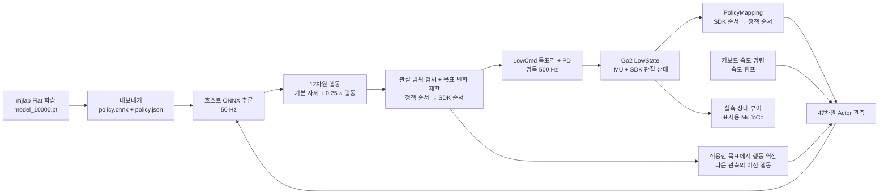

# Go2 sim2real: 시뮬레이션과 실제 로봇의 매핑

이 문서는 `~/go2_rl`의 **Flat 정책을 실제 Go2 센서·모터에 연결하는 규칙**을 정리한다. 확인 기준은 **2026-10-08, `472850eebd2194eb71141b1349087145e4974f30` (`1008_refactor_2`)의 작업 트리**이며, 현재 사용하는 Python 실기 폐루프와 기존 C++ 배포 경로를 함께 대조했다. 모든 인덱스는 0부터 시작한다. 전체 기록 기준은 [상위 README](../README.md), 실행 절차는 [real](../real/README.md), 학습 정의는 [rl](../rl/README.md)에서 확인한다.

오늘 학습 정의는 `src/tasks/go2/`에서 `src/locomotion_rl/go2_baseline/`로, 실기 제어·관측 매핑은 기존 패키지의 `go2_autonomous_driving/real/`로 이동했다. 실기 기본 체크포인트는 `src/go2_autonomous_driving/model_pt/model_10000.pt`다. 새 `src/go2_autodrive/`의 시뮬레이션 체크포인트는 `config/model_pt/model_10000.pt`에 따로 있으며 내용은 같다. 현재 ONNX·metadata와 관측·행동·SDK 매핑 수치는 유지된다.

## 1. 현재 사용하는 연결



Python 폐루프의 입력은 **실제 LowState**다. MuJoCo 뷰어는 받은 자세를 표시하며, 표시 위치는 `[0, 0, 0.32]`로 고정한다. 이 뷰어의 시뮬레이션 결과를 실제 로봇의 정책 입력에 사용하지 않는다. 현재 직접 키보드 폐루프는 odometry·점군 없이 제어하고, ROS 내비게이션 경로는 별도다.

| 대응 항목 | 학습 / Python 시뮬레이션 | Python 실제 로봇 | 기존 C++ 배포 |
|---|---|---|---|
| 정책·매핑 정의 | 학습 설정과 `go2_constants.py` | `artifacts/go2_real/policy.json` | `params/deploy.yaml` |
| 추론 모델 | 체크포인트 Actor | `artifacts/go2_real/policy.onnx` | `exported/policy.onnx` |
| 상태 입력 | mjlab `robot.data` | `/lowstate`의 IMU·모터 | SDK DDS `rt/lowstate` |
| 속도 명령 | 학습 샘플 / 재생 명령 / UDP 내비게이션 | 키보드 요청을 속도 램프 처리 | 조이스틱 축 clamp |
| 명령 출력 | 시뮬레이터 관절 위치 제어기 | `/lowcmd`의 q·kp·kd | SDK DDS `rt/lowcmd`의 q·kp·kd |
| 관절·PD 변환 | 정책 관절 순서 | 위치와 PD 모두 `policy_to_sdk` 적용 | 위치는 `joint_ids_map`, PD는 SDK 순서 직접 사용 |

C++ 경로와 Python 경로는 설정 파일을 독립적으로 읽는다. 한 경로의 정책을 바꿔도 다른 경로의 파일·설정은 자동으로 갱신되지 않는다.

## 2. 관절 순서: 정책 인덱스 ↔ SDK 모터

정책 순서는 `FL → FR → RL → RR`, SDK 모터 순서는 `FR → FL → RR → RL`이고 다리 안에서는 `hip → thigh → calf`다. FL/FR은 앞왼쪽/앞오른쪽, RL/RR은 뒤왼쪽/뒤오른쪽이다.

```text
policy_to_sdk = joint_ids_map = [3, 4, 5, 0, 1, 2, 9, 10, 11, 6, 7, 8]
mapping[정책 인덱스] = SDK 모터 인덱스
```

| 정책 인덱스 | 관절 | SDK 인덱스 | 기본 관절각 (rad) |
|---:|---|---:|---:|
| 0 | FL hip | 3 | -0.1 |
| 1 | FL thigh | 4 | 0.9 |
| 2 | FL calf | 5 | -1.8 |
| 3 | FR hip | 0 | 0.1 |
| 4 | FR thigh | 1 | 0.9 |
| 5 | FR calf | 2 | -1.8 |
| 6 | RL hip | 9 | -0.1 |
| 7 | RL thigh | 10 | 0.9 |
| 8 | RL calf | 11 | -1.8 |
| 9 | RR hip | 6 | 0.1 |
| 10 | RR thigh | 7 | 0.9 |
| 11 | RR calf | 8 | -1.8 |

Python `PolicyMapping`의 입력·출력은 다음 관계다.

```python
# 순서 변환의 핵심을 줄여 쓴 코드
q_policy = q_sdk[order]
dq_policy = dq_sdk[order]
q_target_sdk[order] = q_target_policy
```

예를 들어 SDK 3번에서 FL hip 상태를 읽고, 정책 0번이 만든 목표를 SDK 3번에 쓴다. 이 매핑은 순서를 바꾸며 별도 부호 반전·단위 변환을 하지 않는다. 관절 위치는 rad, 속도는 rad/s다. 이름과 순서는 `policy.json.joint_names`와 `policy_to_sdk`에 기록되어 있으며, 매핑 배열은 0~11의 순열인지 검사한다.

## 3. 실제 상태 → Actor 관측 47개

| 관측 인덱스 | 학습 이름 | 차원 | 실제 로봇에서 만드는 값 |
|---|---|---:|---|
| 0–2 | `base_ang_vel` | 3 | IMU `gyroscope`, 몸체 좌표계 각속도 |
| 3–5 | `projected_gravity` | 3 | IMU quaternion으로 월드 단위 중력 `[0,0,-1]`을 몸체 좌표계로 회전 |
| 6–8 | `command` | 3 | 몸체 기준 `[vx, vy, wz]` 속도 명령, m/s·m/s·rad/s |
| 9–10 | `phase` | 2 | 0.6초 보행 주기의 `[sin(phase), cos(phase)]` |
| 11–22 | `joint_pos` | 12 | `q_sdk[order] - default_joint_pos` |
| 23–34 | `joint_vel` | 12 | `dq_sdk[order]`, 기본 관절 속도는 0 |
| 35–46 | `actions` | 12 | 이전에 적용한 정책 순서의 행동 |
| **합계** | | **47** | float32, ONNX에 `[1,47]`로 입력 |

Flat Critic의 74차원 입력은 학습에 사용하며 실기 추론에는 전달하지 않는다. 현재 실기 export는 이 관측 이름과 순서를 검사한다. Rough의 Actor는 지형 스캔 187개가 추가된 234차원이며, 현재 47차원 실기 구현에 연결하려면 센서·관측 계산을 확장해야 한다.

### 좌표계와 중력

SDK quaternion은 `[w,x,y,z]` 순서다. Python `gravity_body()`는 shape·유한값·노름을 검사하고 정규화한 뒤 `R(q)^T × [0,0,-1]`을 계산한다. 허용하는 quaternion 노름은 `0.95 < norm < 1.05`다. 중력 관측에는 가속도계 원시값을 직접 넣지 않는다. C++은 Eigen quaternion의 켤레로 같은 중력 변환을 계산하며 Python과 같은 명시적 노름 검사를 하지 않는다.

월드 위치·odometry·점군은 이 Flat Actor 입력에 없다. 내비게이션에서 계산한 경로는 속도 명령 `[vx,vy,wz]`를 통해 정책에 반영된다. [시뮬레이터 문서](../simulator/README.md)의 map/odom/base_link 정의와 실제 내비게이션용 외부 위치 추정의 좌표계를 따로 맞춰야 한다.

### 보행 위상과 시간 기준

```text
phase = 2π × ((step × 0.02) mod 0.6) / 0.6
phase_obs = [sin(phase), cos(phase)]
norm([vx,vy,wz]) < 0.1 이면 phase_obs = [0,0]
```

학습은 `episode_length_buf`를 사용한다. Python 실기는 monotonic 경과 시간을 0.02초 스텝으로 반올림해 위상을 만들고, live policy 상태가 바뀌면 위상 기준 시각과 이전 행동을 초기화한다. C++ `gait_phase()`는 관측 함수가 호출될 때마다 위상을 증가시키므로 reset 시 초기 관측에서도 전진한다. 세 경로의 주기는 같지만 초기 위상과 경과 시간 처리가 항상 같지는 않다.

### 정규화와 이전 행동

ONNX에는 Actor의 관측 정규화가 포함된다. `PolicyMapping`은 위 표의 원시 관측을 조합하며 학습용 관측 노이즈를 추가하지 않는다. C++ YAML은 현재 관측 scale=1, clip=null, history_length=1이다.

현재 `ClosedLoopBackend`는 행동으로 만든 목표를 `JointTargetRamp`로 제한한 뒤, `applied_action = (filtered_target_policy - default_joint_pos) / action_scale`을 구해 다음 관측의 이전 행동으로 사용한다. 이 값은 필터 후 목표를 반영한다. 기존 C++은 scale·offset 적용 전 이전 Actor 출력을 사용한다. 따라서 원시 정책·관측의 동등성과 전체 폐루프의 동작 동등성은 확인 범위가 다르다.

## 4. 정책 행동 → 실제 목표 관절각과 PD

기본 변환은 학습·Python 실기·C++에서 같다.

```text
q_target_policy[i] = default_joint_pos[i] + 0.25 × action[i]
q_target_sdk[order[i]] = q_target_policy[i]
```

정책 0번 행동이 0.4면 FL hip 목표는 `-0.1 + 0.25 × 0.4 = 0 rad`이고 SDK 3번으로 전달한다. 정책 출력 자체는 토크가 아닌 관절 위치 목표다.

Python `PolicyMapping.targets()`는 행동 shape·유한값을 검사하고 metadata의 `clip_actions`가 설정되어 있으면 행동을 clip한다. 현재 값은 `null`이다. 이어서 원시 목표가 metadata의 관절 범위를 벗어나면 `Policy target outside joint limits` 오류로 종료한다. 이후 램프는 이미 범위를 통과한 목표를 처리한다.

| 관절 | 모델에서 추출한 목표각 허용 범위 (rad) | Kp | Kd |
|---|---|---:|---:|
| hip, 모든 다리 | [-1.0472, 1.0472] | 20 | 1 |
| 앞다리 thigh | [-1.5708, 3.4907] | 20 | 1 |
| 뒷다리 thigh | [-0.5236, 4.5379] | 20 | 1 |
| calf, 모든 다리 | [-2.7227, -0.83776] | 40 | 2 |

이 범위는 export 때 **MuJoCo 모델에서 읽은 값**이다. 실제 로봇의 교정값·기계 제한을 별도로 확인한 수치라는 의미는 아니다. 학습 위치 제어기는 hip/thigh 23.5, calf 45 N·m의 effort_limit을 설정한다. 이 수치는 LowCmd에 자동 전달되지 않으며 실기 제어기의 동일 토크 제한을 입증하지 않는다.

Python의 `joint_stiffness`, `joint_damping`은 정책 순서라 `to_sdk()`로 재정렬한다. C++ `State_RLBase.enter()`는 YAML의 PD 배열을 SDK 인덱스에 직접 적용하므로 C++ `stiffness/damping`은 SDK 순서로 작성해야 한다. 현재 다리마다 같은 PD값이라 두 표현의 값은 같아 보인다.

Python 현재 폐루프는 속도 명령 가·감속 `[0.5,0.4,1.0]`, 목표 관절 변화율 기본 `12 rad/s`, 보행→정지 전환 시 `0.4초` 동안 `3 rad/s` 제한을 사용한다. 키보드·상태 소실 시의 처리, 모터 명령 검사와 damping 동작은 [real 문서](../real/README.md)를 따른다. 이 제한은 학습 정책 외부의 제어 처리다.

## 5. 시간 간격과 통신

| 루프 | 현재 설정 | 근거 |
|---|---|---|
| mjlab 물리 | 0.005초 / 200 Hz | `step_01_environment/base_env.py` |
| mjlab 정책 | decimation=4 → 0.02초 / 50 Hz | 같은 환경 설정 |
| Python 실기 추론 | metadata step_dt=0.02초 / 50 Hz | `real_robot.py` 추론 스레드 |
| Python 실기 LowCmd | 0.002초 / 500 Hz | `real_robot.py` 메인 발행 루프 |
| C++ 추론 | YAML step_dt=0.02초 / 50 Hz | `State_RLBase.h` |
| C++ FSM·LowCmd 발행 | dt=0.001초 / 1,000 Hz | `CtrlFSM.h`, `FSMState.h` |
| C++ MuJoCo SDK 브리지 | 1 ms 주기 설정 | `simulate/src/unitree_sdk2_bridge.h` |

위 주파수는 스케줄 설정값이다. 실제 도착 간격이나 로봇 내부 제어 주파수의 측정값은 별도로 확인해야 한다. Python `next_period()`는 이미 지난 실행 슬롯을 건너뛰며 지연분을 한 번에 몰아서 실행하지 않는다. 추론과 명령 발행은 독립된 루프이고, 명령 발행은 사용 가능한 최신 목표를 반복한다.

실기 DDS는 domain 0, 기본 네트워크 인터페이스 `enp3s0`이며 `GO2_NETWORK_INTERFACE`로 변경한다. ROS 이름 `/lowstate`, `/lowcmd`는 DDS의 `rt/lowstate`, `rt/lowcmd`에 대응한다. 시뮬레이션 내비게이션은 domain 42와 UDP 9871/9872, 직접 실기 키보드·뷰어는 UDP 9901/9902/9903을 사용한다. 상세 역할은 각 실행 문서에 정리했다.

## 6. 체크포인트와 배포 산출물

현재 Python 실기 산출물은 실제로 존재한다.

```text
~/go2_rl/
├── src/
│   ├── go2_autonomous_driving/model_pt/model_10000.pt  # 실기 기본 경로
│   └── go2_autodrive/config/model_pt/model_10000.pt    # 새 시뮬레이션 기본 경로
└── artifacts/go2_real/
    ├── policy.onnx       # 정규화가 포함된 Actor
    ├── policy.json       # 관절·PD·배율·범위·시간 간격·해시
    ├── parity.npz        # 저장된 원시 관측100×47 / Torch 출력100×12
    └── samples.json      # 대응하는 MuJoCo 관절·IMU·에피소드 스텝
```

루트 `model_10000.pt`는 현재 없다. 두 패키지의 체크포인트는 SHA-256이 같고 실기 `policy.json.checkpoint_sha256`과 일치한다. 기존 체크포인트 내부 iteration은 10000이며, 파일 이동은 재학습을 의미하지 않는다. 이 파일에 대한 원학습 run의 전체 설정·TensorBoard 로그는 현재 작업 폴더에서 연결해 확인하지 못했으므로, 현재 코드로 동일한 전체 학습을 수행했다고 단정하지 않는다. 짧은 학습 확인 기록은 [rl 문서](../rl/README.md)에 별도로 기록했다.

`scripts/export_go2_real_policy.py`는 `src.locomotion_rl`의 Flat play 환경에서 Actor를 로드하고 학습 metadata에 SDK 매핑, 모델 관절 범위, step_dt, 위상 주기, clip_actions와 체크포인트·ONNX SHA256을 더한다. 기본 체크포인트 경로도 실기 패키지의 `model_pt/`로 갱신됐다. ONNX와 JSON은 하나의 정책 세트로 함께 관리해야 한다. 런타임은 파일 해시를 대조한다. `policy.json.run_path`는 export 시 파일명 `model_10000.pt`를 기록하므로 현재 파일 위치를 나타내는 경로로 해석하지 않는다.

| 파일 | 현재 SHA256 |
|---|---|
| `src/go2_autonomous_driving/model_pt/model_10000.pt` | `3e1fb4cd705ce09550c96ee99f120563d7f2aaa638f6ebc261f3559ec8b5c736` |
| `src/go2_autodrive/config/model_pt/model_10000.pt` | `3e1fb4cd705ce09550c96ee99f120563d7f2aaa638f6ebc261f3559ec8b5c736` |
| `artifacts/go2_real/policy.onnx` | `81f29b50a688f7fbf31a2af15007dfaac2b2e95910a97bec023d83a377ed8001` |

기존 C++ 배포 경로는 `deploy/robots/go2/config/policy/velocity/v0/params/deploy.yaml`과 같은 버전의 `exported/policy.onnx`를 읽는다. 현재 그 위치에는 YAML만 있고 ONNX가 없다. Python의 `artifacts/go2_real/policy.onnx`가 자동으로 C++ 폴더에 배치되지는 않는다. C++ 배포 YAML도 ONNX metadata로 자동 생성되지 않는다.

다음은 현재 원본 프로젝트의 export·확인 명령이다. export는 공통 Docker 실행 스크립트를 사용하고, 저장 데이터 parity 검사는 ONNX Runtime이 준비된 호스트 `.venv_go2_real`에서 실행한다. 이번 문서 갱신에서는 기존 산출물로 parity만 재검사했다.

```bash
cd ~/go2_rl
bash scripts/run_go2_docker.sh python scripts/export_go2_real_policy.py \
  --checkpoint src/go2_autonomous_driving/model_pt/model_10000.pt \
  --output artifacts/go2_real

# 저장 데이터와 호스트 ONNX만 사용한다. 로봇 I/O는 없다.
PYTHONDONTWRITEBYTECODE=1 PYTHONPATH="$PWD/src/go2_autonomous_driving" \
  .venv_go2_real/bin/python scripts/check_go2_real_policy.py
```

## 7. 시뮬레이터 ↔ SDK 브리지의 추가 대응

학습은 `xmls/go2.xml`과 `go2_constants.py`의 mjlab actuator 구성을 사용한다. C++ MuJoCo 브리지는 별도의 완결형 `xmls/scene_go2.xml`을 읽으며, 이 scene의 actuator 순서는 SDK와 같은 FR/FL/RR/RL이다. 첫 12개 센서는 관절 위치, 다음 12개는 속도, 다음 12개는 관절 actuator force다. IMU·월드 상태는 `imu_quat`, `imu_gyro`, `imu_acc`, `frame_pos`, `frame_vel` 이름으로 찾는다.

브리지는 센서 i를 SDK motor i에 직접 넣고 LowCmd i를 actuator i에 직접 적용한다. 제어 입력은 `tau + kp*(q_target-q) + kd*(dq_target-dq)`다. 따라서 **scene actuator·센서의 순서 일치**와 **배포 정책 ↔ SDK 매핑**은 각각 확인해야 한다. 학습용 `go2.xml`만 C++ scene으로 지정하면 actuator·센서 구성이 달라 추가 구성이 필요하다.

`scripts/play.py` 재생은 mjlab 체크포인트 경로를 확인하고, C++ 브리지 실행은 DDS·배포 YAML·ONNX·SDK 배열 연결을 확인한다. Python 시뮬레이션 내비게이션에서 쓰는 가상 점군은 상자 표면의 월드 좌표이며 실제 LiDAR와 가림·노이즈 특성이 다르다.

## 8. 확인 결과와 남은 차이

**2026-10-08 이번 문서 갱신 중 직접 실행한 확인:** 이동된 `go2_autonomous_driving.real.real_control.PolicyMapping`을 사용하는 `scripts/check_go2_real_policy.py`, 호스트 `.venv_go2_real` CPU ONNX Runtime, 저장된 시뮬레이션 데이터 100프레임, 로봇 I/O 없이 수행.

| 검증 | 결과 |
|---|---|
| ONNX vs 저장된 원래 Torch Actor 출력 | 최대 절대 오차 `8.344650268554688e-07` |
| SDK 순서로 변환한 저장 관절·IMU → 47차원 관측 복원 | 최대 절대 오차 `1.6689300537109375e-06` |
| 통과 기준 | 두 오차 모두 `< 1e-4`, exit code 0 |
| 파일 일치성 | 체크포인트·ONNX 실제 SHA256과 `policy.json` 일치 |

이 검증은 저장된 MuJoCo 데이터를 SDK 순서로 변환해 관측을 복원한다. 실제 로봇의 센서 교정·축 방향·통신 지연과 폐루프 보행 안정성을 대신 확인하지는 않는다.

오늘 저장된 `log/docker_ros/viewer_result.json`은 컨테이너 뷰어의 HTTP 200과 호스트에서 보낸 가상 측정 자세 138프레임 수신, 모터 출력 없음을 기록한다. 이는 화면·UDP 연결 검사다. 기존 실제 LowState dry-run과 가상 DDS·정지 전환 결과는 2026-10-07의 검증 기록이며, 오늘 새 실보행 결과가 추가된 것은 아니다.

현재 차이와 제한은 다음과 같다.

- 학습의 encoder bias·마찰·질량 중심 랜덤화는 현실 차이에 대한 학습 처리다. 실기 `PolicyMapping`에는 별도 관절 encoder bias 보정값이 없다.
- C++ `bad_orientation()`는 항상 `false`라 기울기 기반 Passive 전환이 작동하지 않는다. Python 경로의 35도 기울기 검사와 별개다.
- `deploy/include/unitree_articulation.h` 끝의 셸 복구 명령은 현재 기준 커밋에도 포함되어 있어 그대로 정상 재빌드할 수 있는 상태로 보기 어렵다. 문서 작성에서는 원본 파일을 수정하지 않았다.
- C++ 버전 폴더에 ONNX가 없어 현재 Python 실기 산출물 존재만으로 C++ 경로를 실행할 수는 없다.
- 2026-10-07의 저장된 전환 시뮬레이션에서 0.5/0.78 m/s 명령의 수정 후 조건은 통과했지만, 1.5 m/s 조건은 정책에 적용 중인 명령 약 1.43 m/s에서 정책 목표 관절 범위를 벗어났다. JSON의 최대 전후 명령 1.5 m/s를 검증된 실기 속도로 해석하면 안 된다. 보고서 조건과 결과는 [simulator](../simulator/README.md)에 있다.
- Flat 47차원 대응 확인과 Rough 배포, 실제 내비게이션·고속 보행 검증은 각각 별도의 작업이다.

정책 교체 시에는 관측 항목·순서·차원, 관절 이름·SDK 매핑, 기본 자세, 행동 배율, PD 배열 순서, 모델 관절 범위, phase_period와 step_dt, 정규화·파일 해시를 함께 대조하고 저장 데이터 parity 검증을 반복한다.

## 9. 원본 파일별 역할

아래 경로는 모두 `~/go2_rl` 기준이다.

| 파일 | 역할 |
|---|---|
| `src/assets/robots/unitree_go2/go2_constants.py` | 학습 기본 자세·위치 제어기·PD·effort_limit |
| `src/locomotion_rl/go2_baseline/step_02_learning/observations.py` | Actor/Critic 관측 순서·노이즈·지형 스캔 |
| `src/locomotion_rl/go2_baseline/step_02_learning/mdp/observations.py` | 학습 위상·발 상태 계산 |
| `src/locomotion_rl/go2_baseline/step_03_training/runner.py` | 학습 중 ONNX export |
| `scripts/export_go2_real_policy.py` | 실제 제어용 모델·JSON·parity 샘플 생성 |
| `scripts/check_go2_real_policy.py` | Torch/ONNX 및 관측 복원 오차 확인 |
| `src/go2_autonomous_driving/go2_autonomous_driving/real/real_control.py` | `PolicyMapping`, quaternion 중력 변환, CRC |
| `src/go2_autonomous_driving/go2_autonomous_driving/real/real_robot.py` | LowState 검사·추론·LowCmd 발행·PD 재정렬 |
| `src/go2_autonomous_driving/go2_autonomous_driving/real/real_closed_loop.py` | 직접 명령·램프·필터 후 이전 행동·실측 뷰어 전달 |
| `src/go2_autonomous_driving/config/real_closed_loop.json` | 속도·변화율·timeout·검사 한계 |
| `src/go2_autonomous_driving/model_pt/model_10000.pt` | 실기 export·폐루프의 현재 기본 체크포인트 |
| `src/go2_autodrive/config/simulation.json`, `src/go2_autodrive/config/model_pt/model_10000.pt` | 새 시뮬레이션 설정과 같은 내용의 체크포인트 |
| `deploy/robots/go2/config/policy/velocity/v0/params/deploy.yaml` | C++ 관절 매핑·관측·행동·PD·주기 |
| `deploy/include/unitree_articulation.h` | C++ IMU·SDK 모터 → 정책 상태 |
| `deploy/include/isaaclab/envs/mdp/observations/observations.h` | C++ 관측과 조이스틱·위상 |
| `deploy/include/isaaclab/envs/mdp/actions/joint_actions.h` | C++ 행동 scale·offset |
| `deploy/robots/go2/src/State_RLBase.cpp` | C++ 모델 로드·정책 목표 → SDK 모터 |
| `simulate/src/unitree_sdk2_bridge.h` | MuJoCo ↔ Unitree SDK DDS 변환 |
