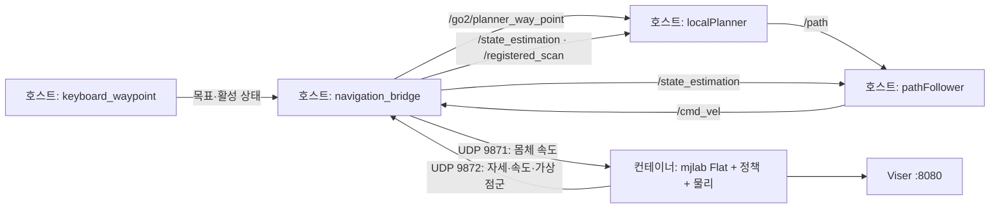

# Go2 시뮬레이터 구성과 현재 사용 방법

이 문서는 **2026-10-07의 `~/go2_rl` 작업 트리**에서 Go2를 어떤 시뮬레이터로 학습·평가하고, 키보드와 경로 플래너를 어떻게 연결하는지 기록한다. 기준 커밋은 `35605c5c01887d7ab099736c357536e5006d64e6`이며, 커밋 이후 로컬 수정도 포함한다. 아래 소스 경로와 실행 명령은 공개 문서 저장소가 아닌 **원본 `~/go2_rl`**을 기준으로 한다. 이번 문서화 과정에서 학습, 시뮬레이션 또는 로봇 제어를 새로 실행하지 않았다.

## 1. 구분해야 하는 세 가지 실행 경로

| 경로 | 목적 | 실행 구성 | 정책과 통신 | 현재 상태 |
| --- | --- | --- | --- | --- |
| mjlab 학습·정책 재생 | 속도 추종 보행 정책 학습 및 성능 확인 | Python / mjlab / MuJoCo Warp | PyTorch 정책, 환경 내부 관측·action | Flat/Rough 환경과 학습·재생 코드가 존재하며, 현재 통합은 Flat 체크포인트 사용 |
| C++ MuJoCo DDS sim2sim | 배포용 제어기를 가상 Go2의 SDK 통신과 연결 | `simulate/`의 `unitree_mujoco` + `deploy/`의 `go2_ctrl` | ONNX 정책, Unitree DDS | 별도 소스 경로. 현재 로컬 배포 헤더 손상으로 빌드 완료 상태로 간주할 수 없음 |
| Python MuJoCo + ROS 2 내비게이션 | 키보드 웨이포인트 → 장애물 회피 경로 → 학습 보행 | 컨테이너 mjlab 1개 환경 + 호스트 ROS 2 플래너 | `model_10000.pt`, 로컬 UDP와 ROS 토픽 | 현재 키보드·플래너 통합의 주 실행 경로 |

실로봇용 MuJoCo 자세 뷰어는 위 물리 시뮬레이터와 역할이 다르다. 실제 IMU·관절 상태를 표시하고 물리 적분과 제어 명령 생성을 하지 않는다. 자세 뷰어와 실로봇 폐루프는 [real 문서](../real/README.md), 시뮬레이션·실기 매핑은 [sim2real 문서](../sim2real/README.md)를 참고한다.

## 2. mjlab 학습·정책 재생

### 환경과 물리 주기

`src/tasks/go2/registry.py`가 `Unitree-Go2-Flat`과 `Unitree-Go2-Rough`를 등록한다. 환경은 `src/tasks/go2/step_01_environment/`, 관측·보상·종료 규칙은 `step_02_learning/`, PPO와 학습은 `step_03_training/`, 정책 재생은 `step_04_evaluation/play.py`에 있다. 학습 방법은 [RL 문서](../rl/README.md)에 정리한다.

| 설정 | 현재 코드 값 | 출처 |
| --- | --- | --- |
| Python 패키지 | `mjlab==1.2.0`, `mujoco-warp==3.5.0` | `setup.py` |
| 물리 timestep | `0.005 s` / 200 Hz | `step_01_environment/base_env.py` |
| 정책 decimation | 물리 4회마다 action 갱신 | 같은 파일 |
| 환경·정책 timestep | `0.02 s` / 50 Hz | `0.005 × 4` |
| 학습 에피소드 길이 | `20 s` | 같은 파일 |
| play 에피소드 길이 | `1e9 s`로 늘림. 넘어짐·비발 접촉 종료 규칙은 유지 | `step_01_environment/go2_env.py` |
| 초기 몸체 위치 | `(0, 0, 0.32) m` | `src/assets/robots/unitree_go2/go2_constants.py` |
| 초기 관절 | 오른쪽 hip `+0.1`, 왼쪽 hip `-0.1`, thigh `0.9`, calf `-1.8 rad` | 같은 파일 |
| 관절 위치 PD | hip/thigh `Kp=20, Kd=1`, calf `Kp=40, Kd=2` | 같은 파일 |
| 토크 한계 | hip/thigh `23.5`, calf `45 Nm` | 같은 파일 |

로봇 본체·관절·메시는 `src/assets/robots/unitree_go2/xmls/go2.xml`에서 읽는다. mjlab은 이 XML에 `BuiltinPositionActuatorCfg`와 충돌 설정을 적용한다. 기본 충돌 구성은 `FULL_COLLISION`이며 발 외의 몸체 충돌도 사용하고 로봇 자체 충돌은 제외한다.

### 평지와 거친 지형

| 항목 | Flat | Rough |
| --- | --- | --- |
| 지형 | 무한 평면 `terrain_type="plane"` | mjlab의 `ROUGH_TERRAINS_CFG` 기반 생성 지형 |
| 높이 관측 | actor·critic의 `height_scan` 제거 | actor·critic에 높이 스캔 포함 |
| terrain_scan | 제거 | `base_link` 기준 yaw 정렬 하향 raycast |
| raycast 범위 | 해당 없음 | 격자 `1.6 × 1.0 m`, 간격 `0.1 m`, 최대 거리 `5 m` |
| 지형 커리큘럼 | 비활성 | 학습에서는 활성, 초기 난이도 최대 level 5 |
| Rough play 지형 | 해당 없음 | 커리큘럼 해제, `5 × 5` 배열, 경계 폭 `10 m`, 리셋 때 지형 재선택 |

Rough 지형의 세부 종류·비율은 원본 프로젝트에서 직접 열거하지 않고 설치된 mjlab의 `ROUGH_TERRAINS_CFG`를 가져온다. 따라서 지형의 실제 구성은 지정 버전의 라이브러리 설정까지 함께 확인해야 한다. 현재 ROS 내비게이션의 두 상자 장애물은 이 Rough 지형 생성기와 별도로 추가된다.

두 환경 모두 `feet_ground_contact`로 발별 접촉 여부·힘·체공 시간을 얻고, `nonfoot_ground_touch`로 비발 접촉을 감지한다. 발 접촉력은 월드 좌표계의 힘이다. 비발 접촉 힘 `10 N` 초과는 종료 조건에 포함된다.

play에서는 actor 관측 잡음과 `push_robot` 외란을 끄고 커리큘럼을 해제한다. **startup 물리 무작위화는 남는다.** 발 마찰 `0.3~1.6`, 엔코더 bias `±0.015 rad`, 몸체 질량중심 각 축 `±0.05 m` 설정은 `events.py`에서 확인할 수 있다. 초기 x/y `±0.5 m`, yaw `±3.14 rad`도 리셋 설정에 남아 있어 재생마다 동일한 조건이 자동 보장되지는 않는다.

### 현재 체크포인트와 관측

현재 내비게이션은 원본 루트의 `model_10000.pt`를 사용한다. 코드가 검사하는 정책 규격은 actor **47차원 입력, 12차원 출력**이며 MLP는 `47 → 512 → 256 → 128 → 12`다. actor 정규화를 포함한 runner의 inference policy를 그대로 사용한다.

| actor 관측 순서 | 차원 |
| --- | ---: |
| 몸체 각속도 | 3 |
| 몸체 좌표계로 투영한 중력 | 3 |
| 속도 명령 `(vx, vy, wz)` | 3 |
| 보행 위상, 주기 `0.6 s` | 2 |
| 기본 자세 기준 관절 위치 | 12 |
| 관절 속도 | 12 |
| 이전 action | 12 |
| 합계 | **47** |

Flat critic은 몸체 선속도, 발 높이·체공 시간·접촉·접촉력까지 포함한 74차원이다. 학습 actor와 내비게이션 actor는 장애물 점군·경로·월드 위치를 직접 입력받지 않는다. 경로 플래너가 결정한 몸체 속도 명령이 정책 입력으로 들어간다.

학습 정책만 재생하는 명령은 다음과 같다. 플래너·ROS 브리지 없이 보행 정책을 보는 경로다.

```bash
cd ~/go2_rl
docker start unitree-rl-mjlab
docker exec -it -w /workspace/unitree_rl_mjlab unitree-rl-mjlab \
  python scripts/play.py Unitree-Go2-Flat \
  --checkpoint-file /workspace/unitree_rl_mjlab/model_10000.pt \
  --num-envs 1 --viewer viser
```

Viser는 기본 `http://localhost:8080`을 사용한다. `--viewer native`는 로컬 MuJoCo 창을 사용하며 `auto`는 DISPLAY/WAYLAND_DISPLAY 유무로 선택한다. `--no-terminations` 옵션은 검사 편의를 위한 종료 규칙 해제이므로 기본 검증 조건과 구분해야 한다.

`scripts/visualize_terrain.py`는 설치된 mjlab의 `ALL_TERRAINS_CFG`를 읽어 지형을 Viser로 표시하는 별도 도구다. 기본 seed는 42, 난이도 범위는 0~1, 행 수는 10이며 GUI로 종류·파라미터를 바꿀 수 있다. 지형 형상을 보는 도구이며 정책의 통과 성능을 측정하는 프로그램은 아니다.

## 3. 현재 Python MuJoCo + ROS 2 내비게이션

### 프로세스 연결



`simulation.py`는 `Unitree-Go2-Flat`의 **play 설정, 환경 1개**를 만들고 속도 command를 UDP 입력으로 교체한다. 정책 GUI 슬라이더가 command를 덮어쓰지 않도록 GUI command 생성도 비활성화한다. 정책이 낸 12개 action은 mjlab의 관절 위치 제어와 MuJoCo 물리를 통해 몸체 이동으로 이어진다.

ROS는 호스트 `/usr/bin/python3`와 Jazzy 환경에서 실행하고, mjlab·PyTorch·MuJoCo Warp는 Docker Python에서 실행한다. Python 환경을 직접 합치지 않고 loopback UDP로 연결한다. 기본 GPU는 사용 가능하면 `cuda:0`이며 코드에는 CPU 선택도 있지만 이 머신의 실행 구성은 NVIDIA 컨테이너를 사용한다.

### 센서, 지도와 좌표

현재 위치추정은 MuJoCo의 실제 시뮬레이션 상태에서 읽은 **ground truth**다. `map` 프레임은 시뮬레이터 월드 좌표이고 `vehicle`은 로봇 몸체 프레임이다. 브리지는 `map → vehicle` TF와 odometry를 발행한다. 이 실행 구성은 SLAM 노드, 실제 LiDAR, 저장된 지도 또는 전역 경로 플래너를 실행하지 않는다.

장애물 점군은 `simulation.py`의 `box_surface_points()`가 설정된 상자의 네 옆면을 샘플링해서 만든다. 상자마다 각 면 수평 11점·높이 5단계를 사용하고, 몸체 xy와의 거리가 `3.5 m` 이내인 점을 선택한다. 가림을 계산하는 ray tracing이나 센서 잡음·실제 LiDAR 스캔 패턴은 구현하지 않는다. 점군은 월드 좌표이며 intensity는 1.0이다.

기본 장애물은 `config/simulation.json`의 두 상자다. `half_size`는 절반 크기이므로 실제 크기는 두 배다.

| 장애물 | 중심 `(x, y, z) m` | 전체 크기 `(x, y, z) m` |
| --- | --- | --- |
| 상자 0 | `(2.0, 0.0, 0.3)` | `(0.4, 0.7, 0.6)` |
| 상자 1 | `(2.0, 1.5, 0.3)` | `(0.6, 0.4, 0.6)` |

상자는 실제 MuJoCo collision geom으로 추가된다. 플래너는 `useTerrainAnalysis=False`, `checkObstacle=True`로 점군 기반 장애물 회피를 수행한다. 높이 관측이 없는 Flat 보행 정책에 상자를 넘어가도록 학습시킨 구성이 아니다.

### 토픽과 실행 주기

| 토픽·연결 | 자료형·프레임 | 용도 |
| --- | --- | --- |
| `/way_point` | `PointStamped`, `map` | 키보드가 새 이동 방향의 목표 발행 |
| `/go2/waypoint_update` | `PointStamped`, `map` | 같은 방향의 연속 목표 갱신 |
| `/go2/navigation_enabled` | `Bool` | 키보드 활성 상태와 heartbeat |
| `/stop` | `Int8` | 키보드가 플래너에 이동 `0`, 정지 `2` 전달 |
| `/go2/planner_way_point` | `PointStamped`, `map` | 브리지가 검사한 목표를 localPlanner에 전달 |
| `/state_estimation` | `Odometry`, `map`, child `vehicle` | 시뮬레이션 자세·몸체 속도 |
| `/registered_scan` | `PointCloud2`, `map` | 상자 표면의 가상 장애물 점군 |
| `/path` | `Path`, `vehicle` | localPlanner의 로컬 경로 |
| `/cmd_vel` | `TwistStamped`, `vehicle` | pathFollower가 계산한 몸체 속도 |
| `/go2/locomotion_command` | `TwistStamped`, `vehicle` | 브리지 gate를 통과해 실제 적용할 속도 |
| `/go2/navigation_status` | `String` | 정지·센서 대기·경로 추종·목표 도달 상태 |
| UDP `127.0.0.1:9871` | JSON | 브리지 → mjlab 속도 command |
| UDP `127.0.0.1:9872` | JSON | mjlab → 브리지 telemetry |

| 항목 | 설정상 주기·한계 |
| --- | --- |
| MuJoCo 물리 / 정책 | 200 Hz / 50 Hz |
| 시뮬레이션 telemetry | 최대 약 10 Hz, wall-clock 0.1초 간격 |
| 브리지 수신 poll / command 송신 | 100 Hz / 20 Hz |
| localPlanner / pathFollower 내부 루프 | 각각 100 Hz. 점군 도착·발행 skip에 따라 실제 출력 빈도는 달라짐 |
| 키보드 활성 heartbeat / 연속 목표 갱신 | 10 Hz / 5 Hz |
| 몸체 속도 command 상한 | 전후 `±0.5 m/s`, 좌우 `±0.2 m/s`, yaw `±0.5 rad/s` |
| 목표 도달 반경 | `0.2 m` |
| 위치·점군·경로·키보드 heartbeat timeout | `0.5 s` |
| 플래너 command / UDP command timeout | `0.3 s` |
| ROS domain | 호스트 실행 예시 `ROS_DOMAIN_ID=42` |

`localPlanner`는 차량 길이 `0.65 m`, 폭 `0.4 m`, 상대 장애물 높이 `-0.2~0.5 m`, 경로 scale `0.8`·최소 `0.5`로 설정한다. `pathFollower`는 전진 중심 추종(`twoWayDrive=False`), 최대 속도 `0.5 m/s`, 가속도 `0.4 m/s²`, `maxYawRate=28.0`을 사용한다. 이 yaw 파라미터는 upstream에서 deg/s를 rad/s로 변환하므로 약 `0.489 rad/s`이고, 브리지에는 별도로 `0.5 rad/s` 한계가 있다. 목표 근처 감속 거리 `0.7 m`, 추종기 정지 거리 `0.15 m`이며 최종 목표 판정은 브리지의 `0.2 m` gate가 맡는다.

브리지는 활성 lease, 현재 목표, 신선한 위치·점군·경로·속도와 프레임을 모두 검사한다. 새 방향 입력 후에는 새 목표 시각 이후 생성된 경로·속도를 기다린다. 같은 방향의 목표 갱신은 유효한 기존 경로를 유지하며 재계획한다. 시뮬레이터 세션이 바뀌거나 에피소드가 리셋되면 이동을 해제하고 새 방향 입력을 요구한다. UDP command는 버전·유한수·timestamp·sequence를 검사하고 stale 또는 역순 packet을 거부한다.

### 의존성과 준비

현재 로컬 Docker 구성은 `docker/docker-compose.yml`이다.

- 컨테이너: `unitree-rl-mjlab`, 작업 경로 `/workspace/unitree_rl_mjlab`.
- 호스트 원본 루트 → 컨테이너 작업 경로에 read/write 마운트.
- host network·host IPC, NVIDIA runtime/GPU, shared memory `8 GB`, `MUJOCO_GL=egl`.
- 이미지 `unitree-rl-mjlab:go2-rl-relocation`은 기존 설치 환경을 보존한 **로컬 이미지 이름**이다. 이 공개 문서만 clone해서 받을 수 있는 배포 이미지가 아니다.
- 호스트: ROS 2 Jazzy, colcon, PCL 개발 라이브러리 및 ROS 메시지·TF 패키지.
- 외부 플래너: `Navigation-Physical-Experiment`의 Jazzy branch 중 `local_planner`와 의존 패키지.

새 머신에서는 원본 프로젝트·의존성을 먼저 준비하고 체크포인트를 루트에 별도로 두어야 한다. 필요한 외부 플래너를 가져오고 빌드하는 명령은 다음과 같다.

```bash
cd ~/go2_rl
git clone --branch jazzy https://github.com/Yuxin916/Navigation-Physical-Experiment.git
source /opt/ros/jazzy/setup.bash
/usr/bin/python3 scripts/build_go2_navigation.py
```

빌드 도구는 `pcl_msgs`와 `perception_pcl`을 `third_party/go2_navigation/src/`에 준비하고 필요한 플래너 복사본을 만든다. 복사본의 사용하지 않는 `pcl_ros` 의존성을 제거하고 Jazzy 종료 context 처리를 보완한다. 원본 외부 저장소의 알고리즘은 그대로 사용한다. 빌드 결과는 원본 루트의 `build/`, `install/`, `log/`에 생긴다.

### 실행

터미널 1에서 호스트 플래너와 브리지를 실행한다.

```bash
cd ~/go2_rl
source /opt/ros/jazzy/setup.bash
source install/setup.bash
export ROS_DOMAIN_ID=42
ros2 launch go2_autonomous_driving simulation.launch.py
```

터미널 2에서 컨테이너의 MuJoCo와 정책을 실행한다. 스크립트가 컨테이너를 시작하고 체크포인트·Python 모듈 경로를 전달한다.

```bash
cd ~/go2_rl
bash scripts/run_go2_simulation.sh
```

브라우저에서 `http://localhost:8080`을 열고 `Loaded ... iter=10000; navigation is initially stopped`가 나올 때까지 기다린다. 컨테이너 이름은 `GO2_MJLAB_CONTAINER`로 바꿀 수 있다. 뷰어를 사용하지 않는 유한 실행은 아래와 같이 지정한다. `--fast`는 실시간 pacing을 제거하므로 플래너 통합 시험의 실제 시간 조건과 다르다.

```bash
bash scripts/run_go2_simulation.sh --viewer none --steps 500
```

터미널 3에서 키보드 노드를 실행한다.

```bash
cd ~/go2_rl
source /opt/ros/jazzy/setup.bash
source install/setup.bash
export ROS_DOMAIN_ID=42
ros2 run go2_autonomous_driving keyboard_waypoint --ros-args \
  --params-file src/go2_autonomous_driving/config/navigation.yaml
```

| 키 | 동작 |
| --- | --- |
| `W` / ↑, `S` / ↓ | 입력 당시 몸체의 전방·후방 방향으로 이동 의도 설정 |
| `A` / ←, `D` / → | 입력 당시 몸체의 왼쪽·오른쪽 방향으로 이동 의도 설정 |
| Space | 이동 의도 해제, 플래너 정지와 정책 속도 0 요청 |
| `Q` / Ctrl+C | 정지 요청 후 키보드 종료 |

기본 `continuous=True`에서는 한 번 누른 방향을 월드 좌표로 기억하고, 현재 위치에서 그 방향 `1 m` 앞 목표를 `0.2 s`마다 갱신한다. 키에서 손을 떼어도 계속 진행한다. 플래너가 회전해도 처음 선택한 월드 이동 방향은 유지하며, 새 키를 누르면 그때의 몸체 방향을 기준으로 바뀐다. 후방·측방 키는 직접적인 실로봇 횡보행 명령과 다르게 플래너의 회전·이동 추종으로 처리될 수 있다.

한 번에 1 m 목표를 보내고 도달 시 정지하려면 `-p continuous:=false`, 앞서 보는 거리를 바꾸려면 `-p waypoint_distance:=2.0`을 사용한다. 속도 명령 0이어도 보행 정책은 자세 유지를 위한 관절 action을 계속 내므로 몸체가 완전히 고정되는 의미는 아니다. 실제 자세 뷰어도 기본 8080을 사용하므로 동시에 띄울 때는 포트를 분리해야 한다.

## 4. C++ MuJoCo DDS sim2sim

이 구성은 ROS 내비게이션과 독립적이다. `simulate/src/main.cc`는 native GLFW MuJoCo 창과 물리 루프를 실행하고 `unitree_sdk2_bridge.h`가 가상 로봇 상태·모터 명령을 Unitree SDK DDS로 연결한다. `deploy/robots/go2/`의 C++ 제어기는 ONNX Runtime으로 정책을 실행한다.

| 항목 | 현재 소스 구성 |
| --- | --- |
| 시뮬레이터 | `simulate/build/unitree_mujoco` |
| 설정 | `simulate/config.yaml` |
| 기본 scene | `src/assets/robots/unitree_go2/xmls/scene_go2.xml` |
| DDS | domain `0`, interface `lo` |
| 리모컨 입력 | Xbox joystick, `/dev/input/js0`, 16 bit, 기본 활성 |
| 가상 elastic band | 기본 비활성 |
| C++ MuJoCo 라이브러리 | `simulate/mujoco/lib/libmujoco.so.3.3.6` |
| C++ SDK bridge / FSM 주기 | 각각 `0.001 s` / 1 kHz 설정 |
| 배포 정책 주기 | `deploy.yaml`의 `0.02 s` / 50 Hz |
| 배포 추론 | bundled ONNX Runtime `1.22.0`, x64/aarch64 디렉터리 별도 |

bridge는 DDS `rt/lowcmd`의 관절 목표·게인·토크에서 `tau + kp*(q_target-q) + kd*(dq_target-dq)`를 계산해 MuJoCo `ctrl`에 넣는다. 가상 LowState에는 관절 q/dq/추정 토크와 IMU quaternion·gyro·accel을 넣고, SportModeState에는 가상 frame position·velocity를 넣는다. bridge 주기 1 kHz와 물리 적분 timestep은 서로 다르다. 이 scene XML은 timestep을 명시하지 않고 물리 루프는 로드된 MuJoCo 모델의 `opt.timestep`을 사용하므로 mjlab의 0.005 s 설정을 이 경로에 그대로 적용해서는 안 된다.

`scene_go2.xml`에는 모터 12개와 FR→FL→RR→RL 순서의 jointpos 12개, jointvel 12개, jointactuatorfrc 12개가 있다. `imu_quat`, `imu_gyro`, `imu_acc`, `frame_pos`, `frame_vel`도 존재해 기본 DDS bridge가 기대하는 센서 배열과 이름에 맞는다. 반면 학습용 `go2.xml`은 mjlab이 actuator를 구성하고 `imu_ang_vel` 등의 다른 센서 이름을 사용한다. **C++ scene을 학습용 XML로 단순 교체하는 것은 호환되는 설정이 아니다.** 기본 높이·충돌 설정 등도 달라 두 시뮬레이터가 동일한 물리 조건이라고 가정하면 안 된다.

`go2_ctrl`은 `Passive → FixStand → Velocity(RLBase)` FSM을 사용한다. 정책 관절 순서→SDK 모터 순서 매핑은 `[3,4,5,0,1,2,9,10,11,6,7,8]`이며, action scale은 0.25다. 정책은 `config/policy/velocity/v0/exported/policy.onnx`, 파라미터는 같은 버전의 `params/deploy.yaml`을 읽는 구조다. 현재 Python 실로봇용 `artifacts/go2_real/policy.onnx`와 이 디렉터리는 별도 산출물이므로 경로가 같다고 취급하지 않는다.

원본 README의 빌드·실행 절차는 다음과 같다. C++17, Unitree SDK2, Boost program_options, yaml-cpp, GLFW, fmt와 배포용 Eigen·DDS·ONNX Runtime 등이 필요하다.

```bash
cd ~/go2_rl
cmake -S simulate -B simulate/build
cmake --build simulate/build -j8
cmake -S deploy/robots/go2 -B deploy/robots/go2/build
cmake --build deploy/robots/go2/build

# 서로 다른 터미널에서 실행하는 가상 로봇과 제어기
./simulate/build/unitree_mujoco
./deploy/robots/go2/build/go2_ctrl --network=lo
```

기본 joystick이 활성화되어 있어 게임패드가 필요하다. C++ 제어기는 domain 0으로 초기화하므로 sim2sim에서는 loopback `lo`를 맞춘다. ROS 내비게이션 domain 42와 구별해야 한다.

**현재 로컬 소스의 한계:** `deploy/include/unitree_articulation.h` 끝에 셸 명령 텍스트가 붙어 있어 정상적인 C++ 소스로 볼 수 없다. 이번 문서화에서는 이를 수정하거나 빌드를 실행하지 않았다. 따라서 위 절차는 저장소가 제공하는 구성 설명이며 현재 작업 트리에서 성공한 실행 절차로 보고하지 않는다. ONNX 산출물·파라미터와 XML의 일치도 재검증이 필요하다.

## 5. 기록으로 확인한 검증 범위

다음 결과는 원본 README·로그·JSON 보고서에서 확인한 기존 기록이다. 이번 공개 문서 작성으로 새로 실행하거나 재현한 결과가 아니다.

| 근거 | 기록된 결과 | 해석 범위 |
| --- | --- | --- |
| `src/go2_autonomous_driving/README.md`의 2026-10-07 검증 | 단위 테스트 46개 통과, W 한 번으로 약 `3.15 m` 연속 전진, Space 후 정지 | 기존 Python MuJoCo·ROS 통합과 제어 로직 검증 기록 |
| `log/go2_sim_to_real_simulation.log`, `log/rename_to_go2_rl/simulation.log` | 체크포인트 `iter=10000` 로딩 및 Viser 실행 로그 | 로딩·실행 기록이며 실보행 품질이나 전체 장애물 회피 성능의 증명은 아님 |
| `log/go2_stop_transition_report.json`, 수정 후 설정 | 목표 속도 0.5·0.78 각각 정지/후진×6위상, 총 **24조건**에서 첫 보호 조건 없음. 최대 관절 오차 각각 `0.4440`, `0.5697 rad` | seed 42, 고정 물리 조건, 50 Hz 정책 시험 |
| 같은 보고서, 목표 속도 1.5 | 수정 전후 모두 12조건에서 약 `3.84 s`, 적용 command `1.43 m/s`에 원래 정책 목표가 관절 한계를 벗어남 | 정지 요청 이전 실패. 고속 보행 문제는 미해결 |
| `log/go2_early_stop_report.json` | 목표 1.5, 가속 후 `1.56 s`에 정지 요청한 6위상은 수정 후 모두 통과, 최대 오차 `0.5835 rad` | 1.5까지 완전히 가속한 보행·정지 성공과 구별 |

정지·후진 검사는 `scripts/check_go2_control_transitions.py`가 실제 모델과 mjlab을 이용해 수행한 것이다. 기본은 고정 물리 조건이고 `--randomized`를 지정하면 play의 물리 무작위화를 유지한다. 첫 보호 조건이 생기면 해당 시험을 실패로 기록하며, 실로봇 모터 루프 500 Hz 전체와 실제 센서·기계 응답을 검증하지 않는다.

현재 내비게이션이 동작 중인 환경에서 통합 검증은 `scripts/check_go2_navigation.py --continuous`로 실행할 수 있다. 이 도구는 초기 command 0, 경로 생성, 전진량, 연속 목표 갱신, Space 후 command 0을 확인한다. `--require-reached`는 단일 목표 도달 상태 검사용이다. 물리 시뮬레이터와 ROS launch가 먼저 실행되어 있어야 하며 이번 문서화에서는 실행하지 않았다.

현재 남은 검증 범위는 실제 LiDAR·위치추정 연결, 다양한 장애물·지형·초기 조건에서의 내비게이션 성능, C++ 배포 경로 복구와 재빌드, 그리고 고속 명령에서 정책 관절 한계 문제다. 평지 시뮬레이션 통과만으로 실로봇 보행 안정성이나 자율주행 성능을 판단할 수 없다.

## 6. 수정 위치 안내

| 바꿀 내용 | 원본 `~/go2_rl`의 파일 |
| --- | --- |
| 물리 timestep·decimation | `src/tasks/go2/step_01_environment/base_env.py` |
| Flat/Rough 환경·play 차이 | `src/tasks/go2/step_01_environment/go2_env.py` |
| 학습 지형 raycast | `src/tasks/go2/step_01_environment/scene.py` |
| 관측·접촉·정책 입력 | `src/tasks/go2/step_02_learning/observations.py` |
| 로봇 기본 자세·PD·충돌 | `src/assets/robots/unitree_go2/go2_constants.py` |
| 시뮬레이션 정책·UDP·가상 센서 | `src/go2_autonomous_driving/go2_autonomous_driving/simulation.py` |
| 장애물·스캔 거리·시뮬레이션 속도 상한 | `src/go2_autonomous_driving/config/simulation.json` |
| ROS 브리지·gate·키보드 설정 | `src/go2_autonomous_driving/config/navigation.yaml` |
| 플래너·추종기 파라미터 | `src/go2_autonomous_driving/launch/simulation.launch.py` |
| 호스트 빌드·Docker 실행 | `scripts/build_go2_navigation.py`, `scripts/run_go2_simulation.sh`, `docker/docker-compose.yml` |
| DDS 시뮬레이터 scene·네트워크 | `simulate/config.yaml`, `simulate/src/unitree_sdk2_bridge.h` |
| C++ 배포 FSM·정책 설정 | `deploy/robots/go2/config/config.yaml`, `deploy/robots/go2/config/policy/velocity/v0/params/deploy.yaml` |
